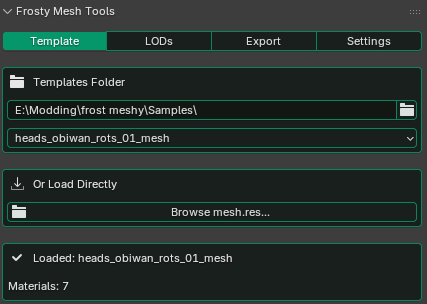

# Frosty Mesh Tools

A Blender addon for renaming LODs, fixing transforms, and exporting FBX meshes for **Frostbite engine modding** using Frosty Editor.

> Tested on Blender 4.5 & 5.0
> Minimum Version: 4.0+

---

## What It Does

- Loads `mesh.res` templates from Frosty Editor
- Extracts material names and valid LOD ranges
- Assigns meshes per material slot and auto-renames to `materialname:lod0` format
- Fixes transforms for Frosty import (unparent, apply, axis rotation, reparent)
- Exports FBX files ready for Frosty import

No guessing material names. No manual transform fixes.

---

## Quick Workflow

1. Load `mesh.res` template (creates a collection for your mesh)
2. Assign meshes to material slots
3. Fix transforms
4. Export FBX
5. Import into Frosty

---

## Features

### Template Loading
Load a `mesh.res` file exported from Frosty Editor. The addon parses material names and LOD ranges, and creates a Blender collection for the mesh.

### LOD Renaming
Assign your meshes to material slots using the assign button. Meshes are automatically renamed to the `materialname:lod0` format that Frosty expects.

### Transform Fix
One-click transform fix for Frosty's coordinate system:
1. Unparents meshes (keeping transforms)
2. Applies rotation, scale, and location
3. Rotates X -90°, applies, rotates X +90°
4. Re-parents meshes to their armature

### FBX Export
Exports all meshes in the template collection as FBX with Frosty-compatible settings (triangulated, tangent space, no animation bake).

---

## Requirements

- Blender 4.0+
- Frosty Editor (for exporting `mesh.res` templates)

---

## Installation

1. Download `frosty_mesh_tools.py`  
2. Blender → Edit → Preferences → Add-ons  
3. Click **Install…** and select the file  
4. Enable the addon  
5. Find it in **3D View → Sidebar → Frosty Mesh**

---

## License

Free for personal and non-commercial use.  
See [LICENSE](LICENSE) for details.